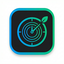
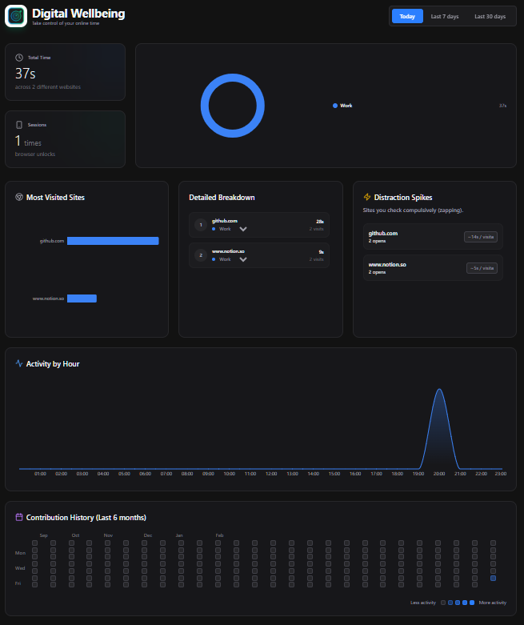
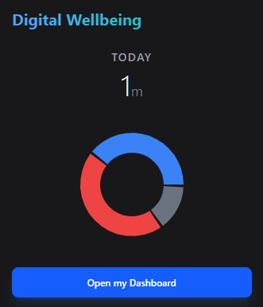

<div align="center">
  
  <h1>Digital Wellbeing</h1>
  <p><strong>Take control of your online time with advanced, privacy-first analytics.</strong></p>
</div>

<br />

## 🚀 Overview

**Digital Wellbeing** is a powerful Chrome Extension inspired by Android's native digital wellbeing features, explicitly designed for desktop power-users. Built with a local-first architecture, it tracks your active tabs and provides deep, actionable insights into your web usage without ever sending a single byte of your data to an external server.

Whether you're trying to optimize your deep work, limit doom-scrolling, or simply understand your digital habits, Digital Wellbeing gives you the beautiful data visualization you need.

## ✨ Key Features

- **📊 Advanced Analytics Dashboard**: Get a comprehensive view of your daily browsing habits. Track your **Total Time** spent online, number of **Sessions** (browser unlocks), and your most visited destinations.
- **⚡ Distraction Spikes (Zapping)**: Automatically identifies websites you check compulsively for short bursts (like quickly refreshing social media), helping you recognize and break micro-distraction patterns.
- **📈 Hourly Heatmap**: An elegant area chart that outlines your peak productivity and distraction hours throughout the day.
- **📅 GitHub-Style Contribution Calendar**: Don't just track today; track your life. View your digital habits over the last 6 months at a glance to see which days were dominated by 'Work' versus 'Leisure'.
- **🏷️ Dynamic Categorization**: Not every website falls neatly into a predefined box. Easily re-categorize any website on the fly right from your dashboard. Changes apply retroactively to all your historical data and recalculate all charts instantly.
- **🔒 100% Privacy-Focused**: Zero servers. Zero trackers. Zero subscriptions. Every piece of data is stored purely locally in your browser using Chrome Storage via a background Service Worker.

## 📸 Screenshots

*(To display these images, name your provided screenshots as `popup.png` and `dashboard.png` and place them inside the `assets/` folder of this repository).*

### Dashboard View
<kbd>
  
</kbd>

### Quick Access Popup
<kbd>
  
</kbd>

## 🛠️ Tech Stack

This extension was crafted using modern web development standards and a robust Manifest V3 architecture:

- **Frontend**: React 18 & Vite
- **Styling**: Tailwind CSS (with beautiful glass-morphism effects and modern dark mode)
- **Data Visualization**: Recharts
- **Extension Engine**: Chrome Extension API (Manifest V3) with strict Background Service Workers
- **Icons**: Lucide React
- **Language**: TypeScript

## ⚙️ Installation & Development

### For Users (Install Unpacked)
1. Clone or download this repository.
2. Open Google Chrome and navigate to `chrome://extensions/`.
3. Enable **Developer mode** in the top right corner.
4. Click **Load unpacked** and select the `/dist` folder inside this project.
5. Pin the extension to your toolbar and enjoy!

### For Developers
If you wish to modify the extension or build it from the source:

1. Clone the repository:
```bash
git clone https://github.com/yourusername/digital-wellbeing.git
cd digital-wellbeing
```

2. Install dependencies:
```bash
npm install
```

3. Build the project:
```bash
npm run build
```
*(This uses `tsc -b && vite build` and generates the final output in the `/dist` folder).*

4. Load the compiled `/dist` folder into Chrome as an unpacked extension.

## 🤝 Contributing

Contributions, issues, and feature requests are welcome! Feel free to check the issues page or fork the repository to add your own statistical charts.

## 📝 License

This project is licensed under the MIT License - feel free to use, modify, and distribute it.
